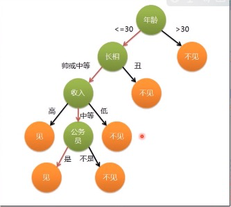

# 机器学习

[谷歌今日上线基于TensorFlow的机器学习速成课程（免费中文版）](https://developers.google.cn/machine-learning/crash-course/ml-intro)

[AiLearning  学习资料](https://github.com/apachecn/AiLearning)

## 一. 机器学习概述

- 机器学习: 研究如何构造理论、算法和计算机系统, 让机器通过从数据中学习后可以进行如下工作: `分类和识别事物`、`推理决策`、`预测未来`等。
- Wiki: " The design and development of algorithms that as input empirical data and yieId patterns or predictions that generated the data."

## 二. 机器学习概述

## 三. 主要分类和学习方法

* 数据聚类
  
    - 目标: 用某种`相似性度量`的方法将原始数据组织成有意义的和有用的`各种数据集`
    - 是一种`非监督学习`方法, 解决方案是`数据驱动的`.
    - [机器学习中的相似性度量](https://www.cnblogs.com/heaad/archive/2011/03/08/1977733.html):通常采用的方法就是计算样本间的“距离”(Distance)
     
      1. 欧氏距离
      2. 曼哈顿距离
      3. 切比雪夫距离
      4. 闵可夫斯基距离
      5. 标准化欧氏距离
      6. 马氏距离
      7. 夹角余弦
      8. 汉明距离
      9. 杰卡德距离 & 杰卡德相似系数
      10. 相关系数 & 相关距离
      11. 信息熵
* 统计分类
    - 基于`概率统计模型`得到各类别的特征向量的分布, 以取得分类的方法
    - `特征向量`分布的获得是基于一个类别已知的训练样本集. 是一种`监督分类`的方法, 分类器是概念驱动的.
    - 相似度模型(Rocchio、K-近邻)、 概率模型(贝叶斯)、线性模型(LLSF、SVM)、非线性模型(决策树、神经网络)、组合模型。
      

* 结构模式识别
* 神经网络
* 监督学习
    - 监督学习是从有标记的训练数据来推断或建立一个模型, 并依次模型推测新的实例.
    - 训练数据包括一套训练实例. 在监督学习中, 每个实例都是由一个输入对象(通常为矢量)和一个期望的输出值(也称为监督信号)组成
    - 一个最佳的模型将能够正确的决定那些看不见的实例的标签. 常用于`分类`和`回归`
* 无监督学习
    - 无监督学习是我们不告诉计算机怎么做, 而是让它自己去学习怎么做一些事情
    - 无监督学习与监督学习的不同之处在于, 事先没有任何训练样本, 需要直接对数据进行建模, 寻找数据的内在结构及规律
    - 常用于`聚类`、 `概率密度估计`
* 半监督学习
    - 半监督学习是模式识别和机器学习领域研究的重点问题, 是监督学习和无监督学习相结合的一种学习方法,
    - 它主要考虑如何利用少量的标注样本和大量的未标注样本进行训练和分类的问题
    - 半监督学习的主要算法有五类: 基于概率的算法、在现有监督算法基础上改进的方法、直接依赖于聚类假设的方法、基于多视图的方法、 基于图的方法.
* 集成学习
* 增强学习
    - 增强学习要解决的问题: 一个能够感知环境的自治机器人, 怎样通过学习选择能达到其目标的最优动作
    - 机器人选择一个动作用于环境, 环境接受该动作后状态发生变化, 同时产生一个强化信号(将或惩)反馈回来
    - 机器人根据强化信号和环境当前状态再选择下一个动作, 选择的原则是使受到正强化(奖)的概率增大
* 深度学习
  