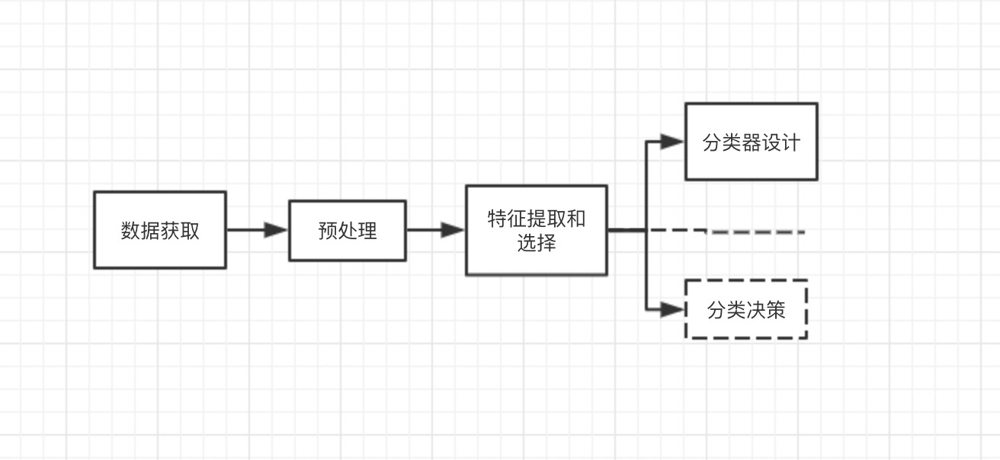
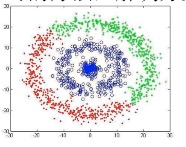

# 机器学习

[AiLearning  学习资料](https://github.com/apachecn/AiLearning)

## 一. 机器学习概述

- 机器学习: 研究如何构造理论、算法和计算机系统, 让机器通过从数据中学习后可以进行如下工作: `分类和识别事物`、`推理决策`、`预测未来`等。
- Wiki: " The design and development of algorithms that as input empirical data and yieId patterns or predictions that generated the data."

## 二. 机器学习概述

## 三. 主要分类和学习方法

* 数据聚类
  
    - 目标: 用某种`相似性度量`的方法将原始数据组织成有意义的和有用的`各种数据集`
    - 是一种`非监督学习`方法, 解决方案是`数据驱动的`.
    - [机器学习中的相似性度量](https://www.cnblogs.com/heaad/archive/2011/03/08/1977733.html):通常采用的方法就是计算样本间的“距离”(Distance)
     
     1. 欧氏距离
     2. 曼哈顿距离
     3. 切比雪夫距离
     4. 闵可夫斯基距离
     5. 标准化欧氏距离
     6. 马氏距离
     7. 夹角余弦
     8. 汉明距离
     9. 杰卡德距离 & 杰卡德相似系数
     10. 相关系数 & 相关距离
     11. 信息熵
* 统计分类
* 结构模式识别
* 神经网络
* 监督学习
* 无监督学习
* 半监督学习
* 集成学习
* 增强学习
* 深度学习
  