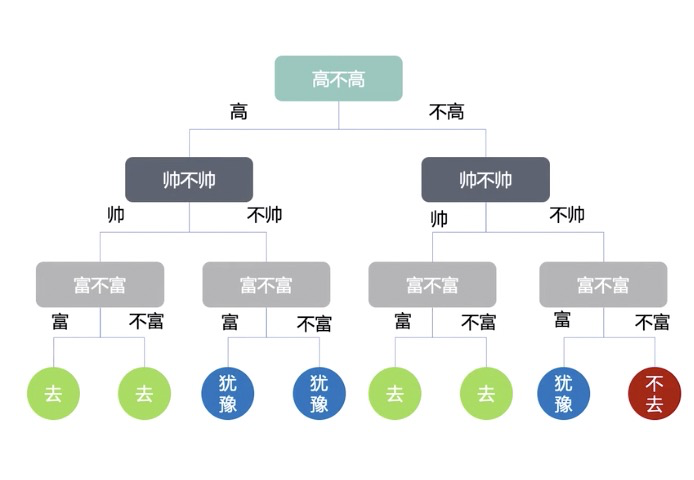
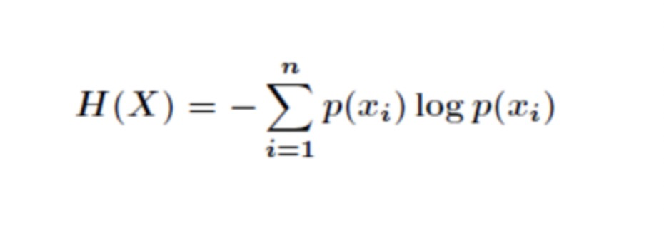
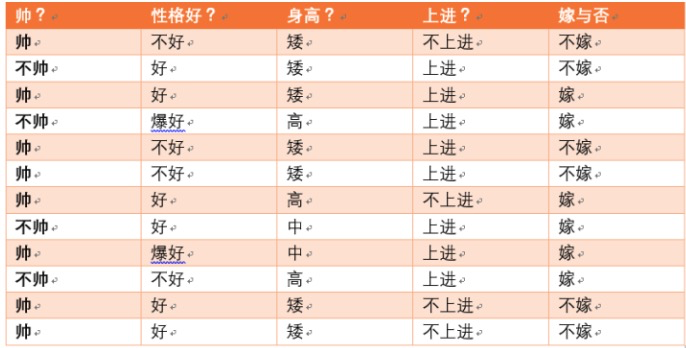
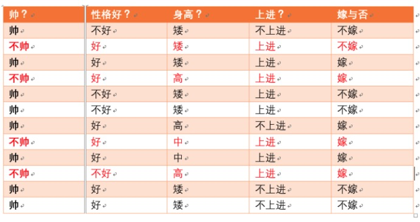

# 一. 决策树

**决策树是什么?** (decision tree)  是一种分类与回归方法，主要用于分类，决策树模型呈现树形结构，是基于输入特征对实例进行分类的模型.(类似下图)

可以理解为倒着的大树:

    1. 其中最顶层的是 **根节点**, 包含数据集中的所有数据的集合 eg: 高不高
    2. 最底层的为 **叶子节点** 叶子节点为最终的类别  eg: 上图中的 去, 不去, 犹豫
    3. 根节点和叶子节点直接的是内部节点, 每个内部节点为一个判断条件, 并且包含数据集中满足从根节点到该节点所有条件的数据集合  eg; 上图中的 帅不帅, 富不富

## 1.1 决策树训练与测试

训练阶段: 从给定的训练集中构造出一棵树
测试阶段: 根据构造出来的树模型从上到下走一遍

一旦构造好了决策树, 那么分类和预测任务就简单了, 只需要走一遍树的流程

那么难点就在于如何构造出一颗数?

## 1.2 如何选择节点 (切分特征)

根节点的选择该用哪个特征? 其他节点呢? 如何切分?

想象一下, 我们的目标应该是选择一个根节点就像老大似的能够很好的切分特征(分类效果好), 其他的自然就是二当家(内部节点)等等

目标: 通过一种**衡量标准**, 来计算不同特征进行分支选择后的分类情况, 找到那个最好的特征作为根节点, 以此类推

那么难点就在于如何构造出一颗数?

## 1.3 衡量标准 -- 熵

熵: 表示随机变量不确定性的度量. 直白的说: 熵表示的就是物体内部的混乱程度

特点: 熵值越低越稳定,  熵值越大越混乱

首先引出公式:

其中$p(x_{i})$代表随机事件X为$x_{i}$的概率

一般以$log_{2}$ 为底的公式:

$$H(X) = \sum_{i=1}^{n}p(x_{i})log_{2}p(x_{i})$$

**eg1:**

*A = {1,1,1,1,1,2}*

解: 其中集合A中1 的概率 为 $\frac{5}{6}$ 
    集合B中2 的概率为 $\frac{1}{6}$
则:
$$H(A) = -\frac{5}{6}log_{2}\frac{5}{6} - \frac{1}{6}log_{2}\frac{1}{6}$$

## 1.4 如何决策一个节点的特征选择呢?

在决策一个节点的特征选择之前,我们先了解一个概念 **条件熵**

条件熵H（Y|X）表示在已知随机变量X的条件下随机变量Y的不确定性.

举例说明:

假设我们有上面数据:

设随机变量*Y={嫁, 不嫁}*

其中嫁的个数为 $\frac{6}{12}$ = $\frac{1}{2}$
其中不嫁的个数为 $\frac{6}{12}$ = $\frac{1}{2}$

那么Y的信息熵为:
 $$H(Y) = -\frac{1}{2}log_{2}\frac{1}{2} -\frac{1}{2}log_{2}\frac{1}{2}$$

为了引出条件熵，我们现在还有一个变量X，代表长相是帅还是不帅，当长相是不帅的时候，统计如下红色所示：

可以得出，当已知不帅的条件下，满足条件的只有4个数据了，这四个数据中，不嫁的个数为1个，占1/4

嫁的个数为3个，占3/4

那么此时的H（Y|X = 不帅）:

$$H(Y|X = 不帅) = -\frac{1}{4}log_{2}\frac{1}{4} -\frac{3}{4}log_{2}\frac{3}{4}$$

p(X = 不帅) = 4/12 = 1/3

同理我们可以得到：

当已知帅的条件下，满足条件的有8个数据了，这八个数据中，不嫁的个数为5个，占5/8

嫁的个数为3个，占3/8

那么此时的H（Y|X = 帅):

$$H(Y|X = 不帅) = -\frac{5}{8}log_{2}\frac{5}{8} -\frac{3}{8}log_{2}\frac{3}{8}$$

p(X = 帅) = 8/12 = 2/3

**计算结果**
有了上面的铺垫之后，我们终于可以计算我们的条件熵了，我们现在需要求：

H（Y|X = 长相）

也就是说，我们想要求出当已知长相的条件下的条件熵。

根据公式我们可以知道，长相可以取帅与不帅俩种

条件熵是另一个变量Y熵对X（条件）的期望。

公式为：

$$H(Y|X) = \sum_{x\epsilon X}p(x)H(Y|X=x)$$

eg:
H（Y|X=长相） = p(X =帅)*H（Y|X=帅）+ p(X =不帅)*H（Y|X=不帅）

然后将上面已经求得的答案带入即可求出条件熵！

那么接下来说说信息增益

### 信息增益: 表示特征*X*使得类*Y*的不确定性减少的程度

$$g(D,A) = H(D) - H(D|A)$$

其中*D*表示训练集, *A*表示某特征